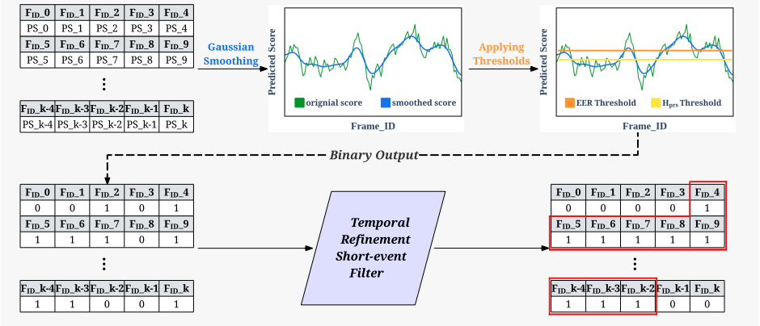
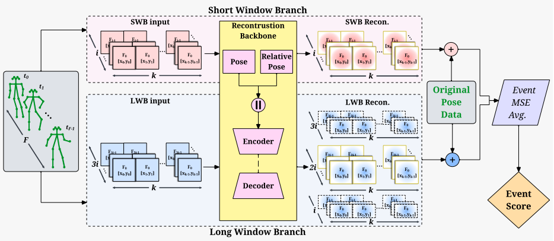

# EventCentric-VAD
This repoitory includes the code for the paper [From Frames to Events: Rethinking Evaluation in Human-Centric Video Anomaly Detection](https://arxiv.org/pdf/2604.09327), accepted for CVPR 2026 conference. In this work, we challenge the conventional frame-level evaluation paradigm in video anomaly detection (VAD), showing that it fails to capture the temporal nature of real-world anomalies and often overestimates model performance.

We propose an event-centric framework that focuses on detecting coherent anomalous events with meaningful start and end boundaries. To achieve this, we introduce (1) a score-refinement pipeline that transforms noisy frame-level predictions into temporally consistent events, and (2) a dual-branch reconstruction model that directly produces event-level anomaly scores using multi-scale temporal context.

We also establish a new evaluation protocol based on temporal IoU and event-level F1 metrics, revealing a significant gap between frame-level accuracy and true event-level performance across standard VAD benchmarks.

## Key Features
- Event-centric reformulation of VAD evaluation
  
- First tIoU-based event-level benchmark for pose-based video anomaly detection (VAD)

- Reveals large gap between frame-level and event-level (real-world) performance
  
- Score-refinement pipeline for frame-to-event transformation
  
- Dual-branch transformer for direct event-level detection
  
- Benchmark audit + cleaned ShanghaiTech dataset
  

## Event-centric Characterization of VAD benchmarks
We establish a foundation by auditing existing VAD datasets, SHT, CHAD, HuVAD, and NWPUC, from an event-centric perspective.

Table: Frame-level and event-level statistics of VAD benchmarks.

<table>
  <thead>
    <tr>
      <th>Granularity</th>
      <th>Characteristic</th>
      <th>SHT</th>
      <th>CHAD</th>
      <th>HuVAD</th>
      <th>NWPUC</th>
    </tr>
  </thead>
  <tbody>
    <tr>
      <td rowspan="2"><b>Frame</b></td>
      <td>Normal Frames</td>
      <td>24,077</td>
      <td>67,303</td>
      <td>694,415</td>
      <td>318,793</td>
    </tr>
    <tr>
      <td>Anomalous Frames</td>
      <td>16,714</td>
      <td>59,172</td>
      <td>225,075</td>
      <td>65,266</td>
    </tr>
    <tr>
      <td rowspan="2"><b>Event</b></td>
      <td>Anomalous Events</td>
      <td>121</td>
      <td>190</td>
      <td>1,691</td>
      <td>137</td>
    </tr>
    <tr>
      <td>Avg. Duration (f)</td>
      <td>138.13</td>
      <td>311.43</td>
      <td>133.10</td>
      <td>476.39</td>
    </tr>
  </tbody>
</table>

Our event-centric analysis shows that the widely used SHT dataset contains micro-events, which are anomalous sequences spanning only a few frames. These likely represent manual annotation noise rather than semantically meaningful human actions. We audited the SHT test set by cross-referencing binary masks with the original videos, filtering out these physically impossible events to ensure every anomaly aligns with actual human movement dynamics. This cleaned version of SHT can be downloded here.

 [Cleaned ShanghaiTech testset]()

 ## The Score-Refinement Pipeline

The following figure illustrates the overall architecture of our Frame-to-Event transformation framework:
<figure>
  
  <figcaption><b>Figure 1:</b> The proposed three-stage Frame-to-Event Transformation framework. Raw anomaly scores undergo hierarchical Gaussian smoothing to surpass high-frequency noise. Adaptive thresholds (τEER and τHprs ) are then applied to the smoothed signal to generate a binary output. Finally, a temporal refinement and short-event filter resolve fragmented detections to produce semantically coherent anomalous events (red boxes) aligned with human motion dynamics.</figcaption>
  </figure>

To apply this pipeline:
- Train your video anomaly detection model and save the results as CSV files containing ground truth labels, frame-level anomaly scores.
- Run `Refinement_pipeline.py` to apply the three-stage refinement process and extract event-level predictions
- Use Metrics_calculation.py to evaluate the event-level performance.

 ## Dual-Branch Reconstruction Event VAD
The following figure illustrates the overall architecture of the Dual branch event-level anomaly detection framework:
<figure>
  
  <figcaption><b>branch event-level anomaly detection framework. Given an input pose sequence, the model processes the data through two
parallel branches: a Short Window Branch (SWB) with temporal length i and a Long Window Branch (LWB) with temporal length
3i. Both branches share the same transformer-based reconstruction backbone [24], which jointly models absolute pose and relative pose
through an encoder-decoder architecture. During inference, each branch produces frame-wise reconstruction errors. The center portion
of the LWB error sequence is temporally aligned with the SWB target window, and the aligned frame-wise scores are fused to form a
context-regularized anomaly response. The fused scores are then temporally pooled over the target window to produce a single event-level
anomaly score.
</figcaption>
  </figure>

## Citation
If you find our work useful, please consider citing: 

## Contact
If you have any questions or need assistance, please contact the authors at nrashvan@charlotte.edu.

